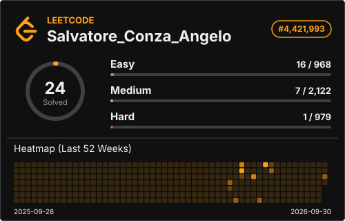
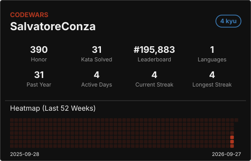
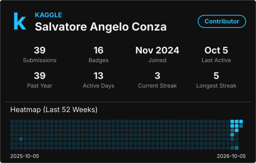
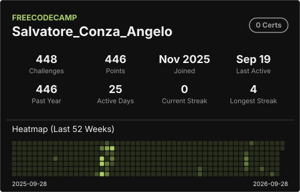
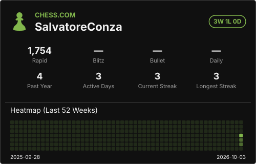
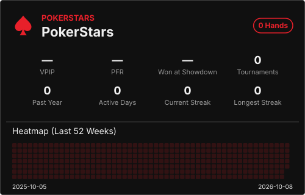

<h1 align="center">Hi 👋, I'm Salvatore, if you want you can call me Salva</h1>
<h3 align="center">Mathematics | Engineering | Complex Systems | ML and NNs </h3>

- 🔭 I'm currently working on **Wind Velocity Maps Predictions via Fourier Neural Operators** and **Graph Neural Operators** 💨🍃
- ⏳ I have worked on **Rat Pose Estimation and Detection via Convolutional Neural Networks** 🐀🐁
- 🌱 I'm currently learning **Machine Learning** and **Deep Learning** by contibuiting to ML/DL repos like DeepChem, Visdom, Alaska Firebanks and ML4SCI.
- 🧩 I'm sharpening my data skills on **Kaggle** and my coding on **LeetCode** and **Codewars**. 
- 🎯 I'm currently trying to land an internship at **GSoC26**, **Vulcanus** or in a **ML Lab**.
- 🏭 On Industry side I was intern at **Fastweb** working on **network traffic simulations** 🌐 and now I am intern at **Leonardo** working on **numerical methods and simulation for plane wings and composite materials** ✈️
- 📫 How to reach me **s.conza@studenti.unina.it**
- 🃏 Curiosity about me: I was [top1000](https://www.reddit.com/r/MarvelSnap/comments/1mbeuna/making_infinite_top_1000_khonshu_discard/) infinite on Marvel Snap (top 0.1%-0.01% of the players). As other card games I also like **poker** ♠️. I also play **chess** ♟️, as teenager I also played in the U16 national tournament. 
- 🌍 I have worked and studied in Italy, Germany, Sweden and Spain.
- 💻 Confident on **Python** 🐍, **C++** ➕➕, **Bash** 🐚 and **SQL** 🗄️

  

 
<table align="center">
  <tr>
    <td valign="top">
      
    </td>
    <td valign="top">
      
    </td>
  </tr>
  <tr>
    <td valign="top">
      
    </td>
    <td valign="top">
      
    </td>
  </tr>
  <tr>
    <td valign="top">
      
    </td>
    <td valign="top">
      
    </td>
  </tr>
</table>

